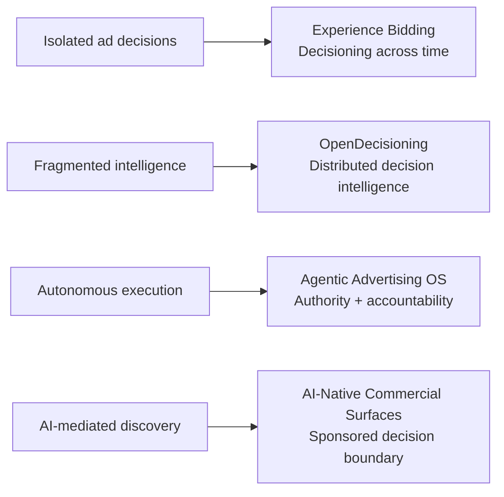

  

  <strong>Rami M. Elsawah</strong> 
  Independent Ad Tech product and systems R&D

## Building the next decision systems for advertising

I use this lab to explore **long-half-life advertising problems**: problems that are likely to keep coming back until the underlying system changes.

The recurring question is not “what feature should we add?” It is **where does the decision actually belong, what information should it use, who has authority, and how do we prove the new system creates incremental value?**

## Research themes

| Theme | Question |
|---|---|
| **Decisioning across time** | What changes when the system remembers what advertising has already accomplished instead of valuing every opportunity in isolation? |
| **Distributed intelligence** | Can independently owned intelligence improve a decision without forcing everyone to centralize their data, models, or authority? |
| **Agent authority** | What has to be true before autonomous agents can make financially consequential advertising decisions? |
| **AI-native commerce** | How can paid discovery participate in an AI-mediated decision without corrupting the organic reasoning that earned the user’s trust? |

## Selected innovations

### 01 · Experience Bidding
**Product hypothesis · ADVANCE / TEST**

> **Give the bidder a memory.**

Most bidding systems are very good at valuing the opportunity in front of them. The harder question is what that opportunity is worth **after accounting for what earlier advertising has already accomplished toward the advertiser’s goal**.

Experience Bidding explores a longitudinal decision layer inside the bidder: use the advertiser’s existing goal plus prior advertising progress to estimate what the **next eligible action can still add**, then return an ordinary bid, adjusted bid, or no-bid through today’s auction rails.

**System shift:**

`isolated impression value → journey-aware marginal value`

**What has to be proven:** Better advertiser outcomes versus ordinary bidding without requiring a new publisher workflow, new exchange protocol, or new advertiser journey object.

---

### 02 · OpenDecisioning
**R&D concept · bounded product experiment justified**

> **Let specialized intelligence contribute without requiring one company to own everything.**

The open internet already moves transactions across companies. The harder problem is whether it can compose **independently owned intelligence** into a governed decision while the rights holder keeps authority over what is allowed.

OpenDecisioning explores a bounded decision layer where a publisher, commerce system, measurement provider, buyer, or other specialist can contribute decision-relevant intelligence without handing over its raw data or model.

**System shift:**

`transaction interoperability → decision interoperability`

**What has to be proven:** One independently owned specialist signal can causally improve one bounded economic decision while permissions, fallback behavior, and existing execution rails remain intact.

---

### 03 · Agentic Advertising Operating System
**R&D concept**

> **Authority before autonomy.**

Agents can increasingly plan, negotiate, activate, optimize, and transact. Execution is becoming easier. **Governed authority is not.**

This concept asks what an advertising system needs when software can commit budget, inventory, data access, or contractual actions on behalf of different principals with different objectives.

The public thesis is simple: autonomous execution needs explicit mandates, constraints, decision rights, evidence, auditability, escalation, and rollback. A smarter agent is not a substitute for a governed market participant.

**System shift:**

`agent can act → agent is authorized, bounded, observable, and accountable`

**What has to be proven:** A shared governance layer reduces real integration and control burden enough to justify existing alongside platform-specific APIs and policies.

---

### 04 · AI-Native Commercial Surfaces
**R&D concept**

> **Sponsored decisions without paid influence over organic reasoning.**

Conversational AI is becoming a discovery and transaction surface. That creates a new advertising boundary: when should commercial options appear, what context may be used, how is sponsorship separated from the organic answer, and how is product truth verified?

The concept explores a sponsored-decision architecture where the assistant first determines the user’s need independently, then evaluates whether paid discovery can help **without allowing advertiser incentives to rewrite the organic answer**.

**System shift:**

`ads beside content → governed commercial participation inside a decision journey`

**What has to be proven:** Paid discovery can improve useful outcomes without degrading trust, privacy, truthfulness, or task completion.

## The map

## What connects the work

The concepts differ, but the design pattern is consistent:

**Find the structural constraint → move the decision to the right system layer → preserve decision rights → use the minimum new machinery → prove incremental value → kill the idea if the evidence does not support it.**

This is a **personal, independent, company-agnostic R&D lab**. The concepts above are public research derivatives and working hypotheses, not employer roadmaps or claims that the systems have been deployed. Detailed mechanisms, prototypes, prior-art work, and implementation designs remain private unless deliberately cleared for publication.
