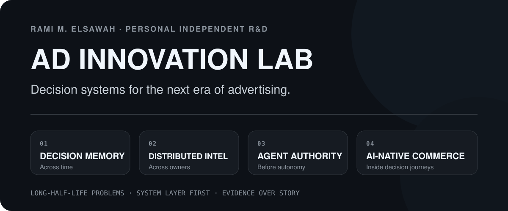

  

  <strong><a href="concepts/README.md">Research Portfolio</a></strong> ·
  <strong><a href="LAB_METHOD.md">Lab Method</a></strong> ·
  <strong><a href="#a-ceo-route-through-the-lab">CEO Route</a></strong> ·
  <strong><a href="docs/index.html">Pitch-Page View</a></strong>

A public R&D lab for advertising decision systems, market architecture, agentic commerce, and the infrastructure required to turn better intelligence into better economic decisions.

> **Lab rule:** no architecture earns the right to exist until a bounded experiment shows the current system is actually the constraint.

## Now in the lab

| Research line | Core question | Stage | First proof |
|---|---|---|---|
| [**Experience Bidding**](concepts/experience-bidding.md) | Can a bidder make better decisions when it remembers what prior advertising already accomplished? | `ADVANCE / TEST` | Longitudinal advertiser state improves ordinary DSP decisions without ecosystem changes. |
| [**Experience Exchange**](concepts/experience-exchange.md) | Does richer intelligence eventually require a new economic unit beyond the isolated impression? | `NORTH STAR · DO NOT BUILD YET` | Existing bid/impression rails materially constrain achievable decision quality. |
| [**OpenDecisioning**](concepts/open-decisioning.md) | Can independently owned intelligence improve decisions without centralizing the underlying data, models, or rights? | `WORKING R&D` | One specialist input causally improves one bounded economic decision. |
| [**Agentic Advertising OS**](concepts/agentic-advertising-os.md) | What governance layer is required when agents can make financially consequential advertising commitments? | `CONCEPT` | A portable decision-and-commitment contract reduces governance or integration burden. |

The operating sequence is simple by design:

`POSSIBILITY → MECHANISM → PROOF / KILL TEST → PROTOTYPE → EVIDENCE → BUILD / NARROW / KILL`

---

## The thesis

Advertising intelligence is accelerating.

Models can reason across intent, commerce, creative, context, measurement, prior exposure, customer state, channel, and time. Agents can increasingly plan and act across systems.

But much of advertising still asks that intelligence to express itself through infrastructure designed around isolated transactions, fragmented ownership, and local optimization.

The lab asks a different question from “where can we add AI?”

> **Where is intelligence being constrained by the system around it, and what is the smallest system change worth making?**

The point is not to predict the future. It is to identify structural problems, propose the smallest useful mechanism, and define the evidence that would prove the idea wrong.

---

## How the lab works

The operating sequence is intentionally unforgiving:

| Step | Question |
|---|---|
| **Possibility** | What structural problem or opportunity will still matter if the current product cycle changes? |
| **Mechanism** | What is the smallest causal system change that could create value? |
| **Proof** | What experiment would show incremental value versus the current system? |
| **Kill test** | What result would tell us not to build it? |
| **Prototype** | What is the cheapest inspectable artifact that resolves a real uncertainty? |
| **Evidence** | Did the mechanism create causal value, or merely look plausible? |
| **Commit / Kill** | Build, narrow, or stop. |

**A prototype is not proof. A compelling diagram is not proof. A new standard is not proof.**

[Read the lab method →](LAB_METHOD.md)

---

## Current research bets

### Experience Bidding

**Give the bidder a memory before rebuilding the market.**

Current bidding can evaluate the next opportunity without a clean economic memory of what prior advertising has already accomplished. Experience Bidding asks what the next eligible action can still add to the advertiser’s configured goal, then uses ordinary bid/no-bid rails.

**Status:** `ADVANCE / TEST`  
**Near-term test:** Can longitudinal advertiser state improve ordinary DSP decisions without ecosystem changes?  
**Kill it if:** the added state does not create incremental value versus control, or operational complexity outweighs the gain.

[Explore Experience Bidding →](concepts/experience-bidding.md)

### Experience Exchange

**First prove the train is constrained by the track. Then consider rebuilding the railroad.**

If advertising intelligence can reason across journeys, surfaces, creative, offers, timing, abstention, and heterogeneous next actions, the impression may eventually become too narrow as the universal economic unit.

The working hypothesis is an intelligence-native demand architecture that values the **next eligible advertising action against an evolving experience state**, with an impression as one execution mechanism rather than the thing being optimized by definition.

**Status:** `WORKING NORTH STAR · DO NOT BUILD YET`  
**First question:** Does the current bid/impression rail materially constrain achievable decision quality?  
**Kill it if:** existing DSP and orchestration architectures absorb richer intelligence without material loss of value.

[Explore Experience Exchange →](concepts/experience-exchange.md)

### OpenDecisioning

**Let specialized intelligence contribute without forcing everyone into one brain.**

The open internet contains valuable intelligence across publishers, advertisers, commerce systems, measurement providers, DSPs, SSPs, and specialists. The research question is whether independently owned intelligence can improve one bounded economic decision without centralizing raw data, models, or decision rights.

**Status:** `WORKING R&D`  
**First proof:** one independently owned specialist input causally improves one bounded decision.  
**Kill it if:** bilateral integrations or proprietary systems solve the problem adequately, or specialist intelligence cannot prove incremental contribution.

[Explore OpenDecisioning →](concepts/open-decisioning.md)

### Agentic Advertising Operating System

**Autonomous execution is easier than autonomous accountability.**

As agents gain the ability to plan, negotiate, activate, optimize, and transact, the hard systems problem moves from interface automation to authority: who may act, for whom, under which constraints, with what evidence, and with what audit, rollback, and dispute path.

**Status:** `CONCEPT`  
**First proof:** a portable decision-and-commitment contract reduces integration or governance burden across multiple market participants.  
**Kill it if:** platform-specific governance plus bilateral APIs scale cleanly enough.

[Explore Agentic Advertising OS →](concepts/agentic-advertising-os.md)

---

## What this lab deliberately does not do

- Add “AI” to a workflow and call it a new system.
- Design a universal protocol before proving one bounded decision.
- Treat demos as causal evidence.
- Create a new exchange because the name sounds futuristic.
- Require the ecosystem to change when the same value can be proven inside an existing participant.
- Hide weak economics behind elegant architecture.
- Preserve an idea after the kill test fails.

The point is not to maximize the number of ideas. It is to reduce the number of bad systems that survive because nobody defined how to falsify them.

---

## A CEO route through the lab

If you are running an advertising, commerce-media, streaming, marketplace, or AI-native business, the useful entry point is not a product pitch.

**Bring the problem that keeps coming back.**

The lab reduces it to six questions:

1. **What is the root problem, not the feature request?**
2. **What business invariants cannot be compromised?**
3. **At what system layer should the problem actually be solved?**
4. **What is the smallest portable mechanism worth testing?**
5. **What experiment would prove incremental value?**
6. **What result kills the thesis?**

That produces a decision, not a brainstorm: **build, narrow, or kill.**

[See the lab method →](LAB_METHOD.md)

---

## Why this is an operating lab, not a trend deck

The method comes from building advertising products and reusable platform capabilities across decisioning, streaming, DSP/SSP systems, marketplaces, measurement, data, and customer experience.

One prior innovation operating model generated **more than $320MM in incremental revenue in 2025** through new advertising products, features, and platform capabilities.

The relevant lesson is not the number. It is the operating model:

> **Experiment and reusable infrastructure have to be built together.**

Otherwise the lab produces prototypes while the business keeps the same constraints.

---

## Portfolio rule

Additional ideas move into the portfolio only when they have:

`structural problem → bounded mechanism → proof design → kill condition`

A polished name, architecture diagram, or prototype is not enough.

[Explore the full research portfolio →](concepts/README.md)

---

## Public R&D boundary

This repository contains **research hypotheses and public-safe abstractions**. It does not claim that the concepts here are deployed products, adopted industry standards, patentable inventions, or capabilities of any specific company. Company-specific work, confidential implementation detail, and restricted prior-employer material are intentionally excluded.

**Better systems should survive contact with evidence. So should the ideas in this repo.**
