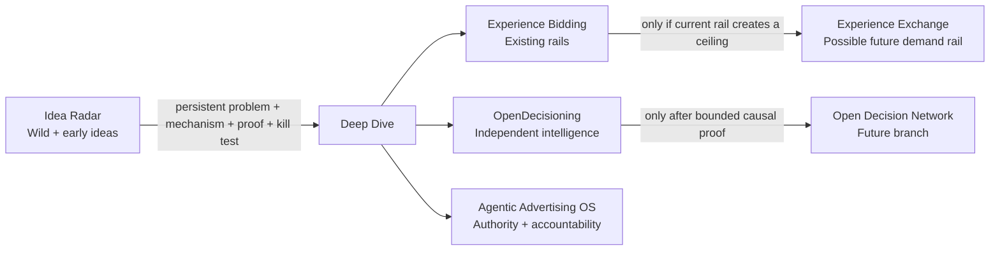

# Deep-Dive Portfolio

> **A small subset of ideas from my personal, independent, company-agnostic ad-tech R&D notebook.**

[← Ad Innovation Lab](../README.md) · [Idea Radar](IDEA_RADAR.md) · [Lab Method](../LAB_METHOD.md) · [Visual View](../docs/index.html)

The [Idea Radar](IDEA_RADAR.md) is intentionally broad and speculative. This folder is the narrower layer: ideas that currently have enough structure to deserve an explicit mechanism, experiment, and kill condition.

These pages are personal research hypotheses. They are not employer work, client work, company roadmaps, product announcements, or claims of deployment or invention at any company.

## Deep dives at a glance

| Research line | Stage | Craziness | Build posture |
|---|---|---:|---|
| [**Experience Bidding**](experience-bidding.md) | `TEST NOW` | `2/5` | **Prototype the gap** |
| [**OpenDecisioning**](open-decisioning.md) | `INCUBATE / TEST` | `3/5` | **Prove one specialist contribution** |
| [**Agentic Advertising OS**](agentic-advertising-os.md) | `INCUBATE` | `3/5` | **Validate the governance burden first** |
| [**Experience Exchange**](experience-exchange.md) | `MOONSHOT · DO NOT BUILD YET` | `5/5` | **Prove the rail is limiting first** |

## Why the portfolio is asymmetric

These ideas are intentionally at different maturity levels.

**Experience Bidding** is closest to a product experiment because it can be tested inside an existing bidder without asking the market to change.

**OpenDecisioning** has a bounded first proof, but broader decision interoperability remains uncertain.

**Agentic Advertising OS** is a governance hypothesis. It only becomes interesting if portable authority, policy, audit, and commitment semantics reduce real operating burden beyond platform-specific controls.

**Experience Exchange** is deliberately held back. Its first job is to prove that increasingly capable intelligence is materially constrained by impression-centric transaction rails. If that ceiling cannot be demonstrated, there is no reason to invent a new exchange.

## How an idea gets here

A radar item graduates to a deep dive only after it has:

`persistent problem → system boundary → mechanism → bounded proof → kill condition`

A good name or an elegant diagram is not enough.

## How every deep dive is evaluated

### 1. Possibility
What structural problem could remain even as models, identity, measurement, and compute improve?

### 2. System boundary
What must change, and what should deliberately remain untouched?

### 3. Mechanism
What is the smallest causal system change that could create value?

### 4. Proof
What bounded experiment can separate real incremental value from a compelling story?

### 5. Kill test
What result means the idea should be narrowed, held, or stopped?

### 6. Decision
Build, narrow, hold, or kill.

## What is not evidence

A prototype is not proof. A new name is not a category. A diagram is not an architecture decision. A model that can execute is not evidence that it should have authority. Correlation is not causal incrementality. A public R&D page is not a claim of deployment, adoption, patentability, employer sponsorship, or company endorsement.

## Suggested reading order

1. [**Idea Radar**](IDEA_RADAR.md) — see the full range from practical to wild.
2. [**Experience Bidding**](experience-bidding.md) — the near-term product experiment.
3. [**OpenDecisioning**](open-decisioning.md) — the independent-intelligence problem.
4. [**Agentic Advertising OS**](agentic-advertising-os.md) — the authority problem created by autonomous actors.
5. [**Experience Exchange**](experience-exchange.md) — what becomes interesting only if current rails prove limiting.

If an idea cannot survive its kill test, it does not stay serious merely because the story is good.
