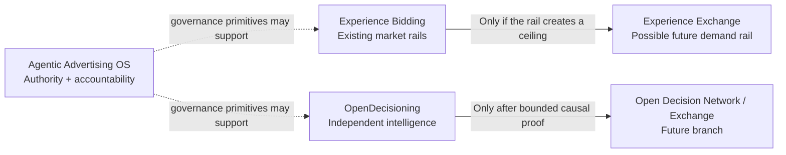

# Research Portfolio

> **Four research lines. One rule: change the system only after evidence shows the system is the constraint.**

[← Ad Innovation Lab](../README.md) · [Lab Method](../LAB_METHOD.md) · [Pitch-Page View](../docs/index.html)

The concepts in this folder are not trend predictions or product announcements. They are bounded research bets with explicit mechanisms, experiments, and kill conditions.

## Portfolio at a glance

| Research line | Core question | Stage | Build posture |
|---|---|---|---|
| [**Experience Bidding**](experience-bidding.md) | Can a bidder make better decisions when it remembers what prior advertising already accomplished? | `ADVANCE / TEST` | **Prototype the gap** |
| [**Experience Exchange**](experience-exchange.md) | Does richer intelligence eventually require a new economic unit beyond the isolated impression? | `NORTH STAR · DO NOT BUILD YET` | **Prove the rail is limiting first** |
| [**OpenDecisioning**](open-decisioning.md) | Can independently owned intelligence improve one decision without centralizing the underlying data, models, or rights? | `WORKING R&D` | **Prove one specialist contribution** |
| [**Agentic Advertising OS**](agentic-advertising-os.md) | What governance layer is required when agents can make financially consequential advertising commitments? | `CONCEPT` | **Validate the governance burden first** |

## The portfolio is deliberately asymmetric

These ideas are not all at the same maturity level.

**Experience Bidding** is closest to a product experiment because it can be tested inside an existing bidder without asking the market to change.

**Experience Exchange** is intentionally held back. Its first job is to prove that increasingly capable intelligence is materially constrained by impression-centric transaction rails. If that ceiling cannot be demonstrated, there is no reason to invent a new exchange.

**OpenDecisioning** asks a different systems question: whether specialized intelligence can remain independently owned yet still contribute causally to a shared decision. The first proof is one bounded decision, not a universal protocol.

**Agentic Advertising OS** is a governance hypothesis. It becomes useful only if portable authority, policy, audit, and commitment semantics reduce real integration or control burden beyond what platform-specific APIs already provide.

## How every concept is evaluated

Each concept page follows the same operating grammar:

`POSSIBILITY → SYSTEM BOUNDARY → MECHANISM → PROOF → KILL TEST → DECISION`

### 1. Possibility
What structural problem remains after the current product cycle changes?

### 2. System boundary
What must change, and what should deliberately remain untouched?

### 3. Mechanism
What is the smallest causal change that could create value?

### 4. Proof
What bounded experiment can separate real incremental value from a compelling diagram?

### 5. Kill test
What result means the idea should be narrowed or stopped?

### 6. Decision
Build, narrow, hold, or kill.

## What is not evidence

A prototype is not proof. A new name is not a category. A diagram is not an architecture decision. A model that can execute is not evidence that it should have authority. A correlation is not causal incrementality. A public R&D page is not a claim of deployment, adoption, patentability, or company endorsement.

## Suggested reading order

If you want the shortest route through the thinking:

1. [**Experience Bidding**](experience-bidding.md) — the near-term product experiment.
2. [**Experience Exchange**](experience-exchange.md) — what becomes interesting only if the current rail proves limiting.
3. [**OpenDecisioning**](open-decisioning.md) — the independent-intelligence problem.
4. [**Agentic Advertising OS**](agentic-advertising-os.md) — the authority problem created by autonomous actors.

If an idea cannot survive its kill test, it does not stay in the portfolio merely because the story is good.
