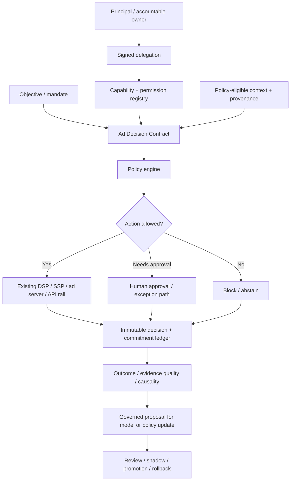
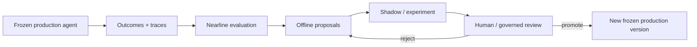

# Agentic Advertising Operating System

> ## Autonomous execution is easier than autonomous accountability.

**Status:** `CONCEPT`  
**Type:** governed multi-party decision and commitment layer  
**Build posture:** validate that portable governance reduces real burden before standardizing anything

[← Research Portfolio](README.md) · [Lab Method](../LAB_METHOD.md) · [Ad Innovation Lab](../README.md)

## Executive thesis

Advertising agents can increasingly plan, negotiate, activate, optimize, and transact. Calling an API is no longer the interesting systems problem.

The hard problem is authority:

> **Who may act, for whom, toward which objective, with what money, data, inventory, and tools, under which constraints, and with what evidence when the action becomes financially consequential?**

An agentic market without explicit authority and accountability can move faster while making it harder to answer the most basic operating questions after something goes wrong.

---

## The problem moves from interface to commitment

A conventional workflow often assumes a human operator sits somewhere in the loop and implicitly carries authority, context, judgment, and escalation responsibility.

As agents become more autonomous, those assumptions need to become machine-readable and enforceable.

A useful system must be able to represent and audit:

- the principal the agent represents;
- the objective it is authorized to pursue;
- the money, data, inventory, tools, and actions it may use;
- constraints it may never override;
- the duration and scope of its delegation;
- conflicts between buyer, seller, platform, data, and customer-experience authority;
- commitments already made;
- the evidence used for each material action;
- human approval or exception requirements;
- emergency suspension; and
- rollback, dispute, and learning paths.

---

## Authority is not one thing

Advertising is already multi-party. Agentic execution does not erase that fact.

| Decision right | Natural authority |
|---|---|
| Budget and advertiser objective | **Buyer / advertiser** |
| Inventory, pricing, eligibility | **Publisher / seller** |
| Viewer or customer experience | **Surface owner** |
| Data and identity use | **Data / privacy owner** |
| Marketplace integrity and reliability | **Transaction platform** |
| Evidence admitted to learning | **Buyer + measurement / governance owner** |
| Emergency suspension | **Accountable operator** |

The architecture fails if "agentic" becomes shorthand for letting one actor silently absorb everyone else's decision rights.

---

## Candidate control architecture

The working hypothesis is a **model-neutral control layer above existing execution systems**.

The goal is not to replace DSPs, SSPs, ad servers, or market APIs. Those remain execution rails.

The control layer makes authority, constraints, commitments, and evidence explicit enough that autonomous execution remains attributable.

---

## Candidate primitives

### Signed delegation

Defines who granted authority, to which agent or system, for what scope, and for how long.

### Capability registry

Defines which tools, data, inventory, money, and actions the agent may access.

### Ad Decision Contract

A bounded representation of the objective, allowed action vocabulary, constraints, represented principal, relevant context, approval threshold, fallback, and evidence requirements for one class of decision.

### Policy engine

Enforces privacy, budget, eligibility, brand, experience, contractual, reliability, and other non-negotiable rules before execution.

### Decision and commitment ledger

Records which version of the agent, policy, delegation, context, and evidence produced a material action or commitment.

### Evidence-quality labels

Separate observed outcomes from estimates, attribution, correlation, causal evidence, missing evidence, and disputed evidence.

### Governed promotion

Production agents should not promote their own permissions, policy thresholds, or successor versions. Candidate behavior is proposed, evaluated, shadowed, reviewed, promoted, and reversible.

---

## Three learning clocks

A useful agentic system should not treat live action, evaluation, and self-improvement as the same loop.

| Clock | Role | Rule |
|---|---|---|
| **Real-time decision agent** | takes bounded live action | frozen version, attributable behavior |
| **Nearline evaluation** | measures causal outcome, drift, safety, constraint adherence | can recommend, cannot silently rewrite production |
| **Offline proposal** | generates candidate strategies, models, policies, or experiments | no direct production authority |

This separation preserves learning without allowing an agent to expand its own authority because its internal objective says doing so would be useful.

---

## First proof

Do not begin by designing a universal standard.

Define a minimum decision contract for a small set of real multi-party actions, such as:

1. autonomous premium-video deal activation;
2. publisher-side model execution; or
3. governed cross-platform budget reallocation.

Test the contract with participants representing the actual authority boundaries: buyer/DSP, SSP, publisher/ad server, agency, and measurement/data platform.

### Advance criterion

Advance only if multiple participants identify a measurable reduction in integration, governance, audit, or operating burden that cannot be achieved as cleanly through existing bilateral APIs and platform-specific controls.

---

## Failure modes worth designing for

| Failure mode | Why it matters |
|---|---|
| **Objective collision** | buyer and seller incentives are not identical |
| **Permission drift** | agent capability can expand beyond the scope originally intended |
| **Model / policy drift** | behavior can change while the business assumes the same controls still hold |
| **Delayed outcomes** | agents may keep acting before poor downstream results are visible |
| **Fraud / noisy evidence** | a learning loop can optimize toward manipulated feedback |
| **Irreversible commitments** | some financial or contractual actions cannot simply be undone |
| **Compromised agent** | autonomous speed can amplify financial, privacy, or brand harm |
| **Opaque escalation** | nobody knows who can stop the system when authority is distributed |

The value proposition is not autonomy by itself. It is **bounded autonomy with attributable commitments.**

---

## Kill tests

Reject or narrow the thesis if:

1. bilateral APIs and platform-specific governance scale cleanly enough;
2. portable authority semantics expose strategy or reduce flexibility more than they reduce burden;
3. standards add latency or lowest-common-denominator semantics without measurable value;
4. participants will not expose enough authority metadata to make the contract useful;
5. human approval remains necessary for nearly every material action;
6. the mechanism duplicates existing standards without operating advantage; or
7. the governance layer becomes another platform that centralizes control rather than making control explicit.

---

## What this is not

- a chatbot for media buying;
- an agent marketplace;
- a replacement DSP or SSP;
- a permissionless autonomous trading system;
- a claim that self-modifying agents should control live financial decisions; or
- a reason to collapse publisher, buyer, platform, and data-owner authority into one agent.

## Relationship to the portfolio

Agentic Advertising OS is orthogonal to the other research lines.

**Experience Bidding** asks how a bidder can make better stateful economic decisions on existing rails.

**OpenDecisioning** asks how independently owned intelligence can contribute to a shared decision while preserving rights and ownership.

**Agentic Advertising OS** asks what control and accountability become necessary when software actors can execute those decisions autonomously.

The governance primitives may eventually support the others, but they are not evidence those products require this control layer.

## Public boundary

This is a research hypothesis about governance and market architecture. It is not a deployed product claim, a description of any company's internal agent system, or a claim that a new standard is required. The first task is to prove the governance burden exists at sufficient scale to justify a portable layer.
