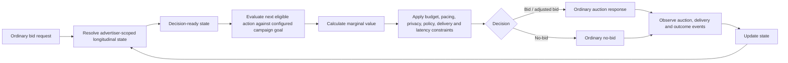

# Experience Bidding

> ## Give the bidder a memory before rebuilding the market.

**Status:** `ADVANCE / TEST`  
**Type:** buyer-side product hypothesis on existing market rails  
**Build posture:** prototype only the gap that existing bidder architecture does not already solve

[← Research Portfolio](README.md) · [Lab Method](../LAB_METHOD.md) · [Ad Innovation Lab](../README.md)

## Executive thesis

Advertising systems make enormous numbers of decisions, but the next bid opportunity does not necessarily arrive with a clean economic memory of what prior advertising has already accomplished toward the advertiser's objective.

Experience Bidding asks one question:

> **Given what advertising has already accomplished, what can this next eligible action still add?**

The important constraint is architectural restraint: prove the value **inside the bidder and on ordinary market rails** before asking publishers, exchanges, agencies, retailers, or advertisers to adopt anything new.

---

## The problem

A bidder can be highly sophisticated at valuing an isolated opportunity and still reason poorly across a sequence of advertising actions.

If prior advertising changed customer state, created partial progress, triggered a pending action, or already satisfied part of the configured goal, then the marginal value of the next impression may be different from its value at the start of the journey.

The product hypothesis is not "better attribution." It is **stateful economic decisioning before the next action is taken.**

## System boundary

### What changes

The bidder gains an advertiser-scoped longitudinal state layer and uses that state when valuing the next eligible action.

### What deliberately does not change

- no required new publisher field;
- no new SSP or exchange protocol;
- no advertiser-side journey object;
- no new universal identity scheme;
- no external token that replaces normal transaction identifiers;
- no requirement that the market understand Experience Bidding exists.

The internal state key can remain inside the bidder.

---

## Decision architecture



### State model

The working state is deliberately descriptive rather than magical:

`confirmed history + provisional progress + pending actions + observed outcomes`

| State component | Meaning | Important boundary |
|---|---|---|
| **Confirmed history** | observed prior advertising events and outcomes | evidence, not a prediction |
| **Provisional progress** | estimate of what advertising may already have accomplished toward the configured goal | not money and not a universally scarce balance |
| **Pending actions** | decisions, wins, impressions, or other events that have not fully resolved yet | prevents treating unresolved work as if nothing happened |
| **Observed outcomes** | known downstream results | delayed and incomplete by nature |

Provisional progress may be revised, decayed, reversed, or settled as better evidence arrives. Unlike a budget, it is not automatically something that must be "consumed."

---

## The experiment

Experience Bidding only earns the right to exist if a controlled treatment beats ordinary decisioning.

| | Control | Treatment |
|---|---|---|
| Campaign configuration | same | same |
| Objective | same configured advertiser goal | same configured advertiser goal |
| Decisioning | ordinary bidder | ordinary bidder + longitudinal economic state |
| Budget / pacing | isolated ledger or valid split | isolated ledger or valid split |
| External auction rails | unchanged | unchanged |

Persistent assignment matters. Budget and pacing isolation matter. If Treatment spending changes Control's opportunity set, the experiment becomes contaminated.

### Universal launch rule

```text
Launch Treatment when the campaign-configured goal improves versus Control
AND delivery, budget, privacy, policy, latency, and reliability guardrails pass.
```

The configured goal is not assumed to be ROAS. It may be revenue, purchase, reach, attention, completed view, lift, or another objective the campaign already uses.

---

## Kill gates before build

Do not prototype merely because the narrative is attractive. First determine whether the target bidder already has materially equivalent capability.

Kill or narrow the thesis if:

1. existing bidder state already represents the same longitudinal customer/advertiser state;
2. existing optimization already calculates materially equivalent marginal-next-action value;
3. state cannot be read safely inside the latency budget;
4. identity continuity is too weak for a valid experiment;
5. budget/pacing isolation cannot prevent treatment contamination;
6. the configured goal does not improve incrementally versus Control; or
7. proving value requires ecosystem adoption, violating the zero-integration premise.

## Engineering questions that actually matter

A useful prototype should resolve concrete uncertainties rather than demonstrate generic architecture:

- Where is state materialized?
- Is the read synchronous, asynchronous, cached, or precomputed?
- What happens when outcomes arrive late?
- How is stale state detected?
- How is identity continuity bounded without inventing a new identity system?
- What is the deterministic fallback when state is missing or unavailable?
- How are pending decisions and wins reconciled?
- What is retained, for how long, and under what privacy rules?
- Can a decision be replayed and audited against the state version it read?
- Does the target bidder already do enough of this that a distinct product adds no value?

---

## Research collisions that made the idea smaller

Broad "journey-aware bidding" is not a novel category. Modern DSPs and optimization systems already reason across funnel stages, channel paths, product catalogs, holdouts, attribution, and sequential actions.

That collision is useful. It forces the product wedge to become narrower:

> **DSP-internal, zero-integration longitudinal state used to value what the next action can still add.**

The product can be worth testing even if the broad semantic idea is not patentable. Novelty is not the launch criterion. Incremental advertiser value is.

---

## Portfolio role

Experience Bidding is the bridge experiment for a larger architecture question.

```text
ordinary impression bidding
        ↓
Experience Bidding on existing rails
        ↓ only if the rail creates a measurable ceiling
next-action / experience valuation
        ↓
possible Experience Exchange
```

If Experience Bidding captures most of the available value, the larger market architecture may be unnecessary. That is a successful research outcome, not a failure.

## Public boundary

This is a research product hypothesis, not a claim of deployment, adoption, patentability, or performance by any specific DSP or advertiser. Examples and system diagrams are public-safe abstractions intended to make the hypothesis testable.
