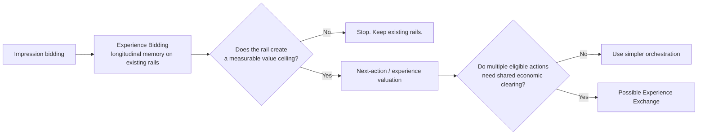
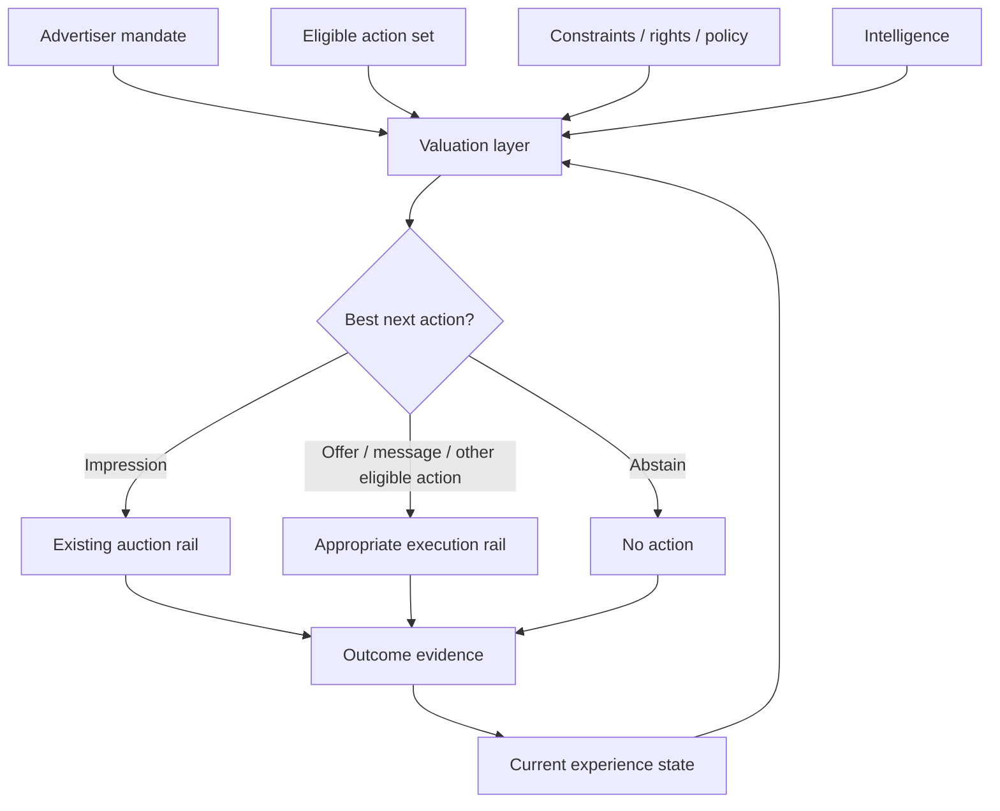

# Experience Exchange

> ## What if the impression becomes too small for the intelligence making the decision?

**Status:** `WORKING NORTH STAR · DO NOT BUILD YET`  
**Type:** future demand-architecture research branch  
**Build posture:** prove the current rail creates a measurable ceiling before designing a new one

[← Research Portfolio](README.md) · [Experience Bidding](experience-bidding.md) · [Lab Method](../LAB_METHOD.md)

## Executive thesis

Experience Bidding deliberately works on today's rails. A normal impression opportunity arrives, the bidder adds longitudinal economic memory, values what the next eligible action can still add, and returns an ordinary bid or no-bid.

The longer-horizon question is whether increasingly capable advertising intelligence eventually outgrows the **impression as the universal optimization and transaction unit**.

> **Intelligence is the train. The bidding and transaction system is the track. First prove the train is constrained by the track before rebuilding the railroad.**

This is not a proposal to launch another exchange. It is a falsifiable research question about whether the current economic object creates a ceiling on decision quality.

---

## Why the rail might matter

Modern advertising intelligence can reason over more than one impression at a time. It can potentially combine:

- advertiser objectives;
- commerce and intent signals;
- prior exposures and outcomes;
- creative response;
- customer state;
- channel and surface;
- timing;
- offers;
- suppression and abstention;
- measurement and causal evidence; and
- multiple possible next actions.

An impression auction is excellent at clearing one type of opportunity. The research question is whether that local transaction model eventually becomes too narrow for intelligence trying to optimize a larger sequence of actions.

## What would have to be constrained

The current rail must materially limit at least one important capability before a new architecture is justified.

| Candidate constraint | Question to test |
|---|---|
| **Action space** | Can intelligence choose only among impression opportunities when a different action would create more value? |
| **State continuity** | Is longitudinal advertiser/customer state degraded or fragmented between transactions? |
| **Cross-surface coordination** | Can channel, surface, creative, offer, and timing be valued coherently together? |
| **Feedback speed** | Can outcomes update the next economic decision quickly enough? |
| **Abstention** | Can the system express "do nothing" as an economically meaningful action rather than only a missing bid? |
| **Successive-action learning** | Can the system learn causal value across a sequence rather than optimize isolated transactions? |
| **Heterogeneous valuation** | Can unlike next actions be compared under one advertiser mandate without arbitrary conversion? |

If modern bidder and orchestration systems already solve these well enough, the thesis should stop.

---

## Research progression



Experience Bidding is therefore not just a product idea. It is the bridge experiment that protects this research line from premature architecture.

---

## Candidate architecture

The working abstraction is:

```text
advertiser mandate
+ current experience state
+ eligible action set
+ constraints
+ intelligence
        ↓
marginal action values
        ↓
allocate / abstain
        ↓
execute through appropriate rail
        ↓
bind outcome
        ↓
update state
```



The term **exchange** is earned only if the architecture actually compares or clears among multiple eligible actions, surfaces, suppliers, or execution paths under shared economic state.

If it is merely a smarter bidder or workflow orchestrator, it should not be called an exchange.

---

## The atomic economic object is unresolved

Before designing market infrastructure, the research must determine what is actually being valued.

| Candidate object | Advantage | Failure mode |
|---|---|---|
| **Impression** | existing liquid market and clear execution semantics | may be too local for richer action spaces |
| **Opportunity** | broader than an impression | can still remain surface-specific |
| **Action** | permits heterogeneous next-step choice | unlike actions may be difficult to compare coherently |
| **Outcome contribution** | directly tied to advertiser value | delayed, noisy, and difficult to estimate causally in real time |
| **Experience increment** | aligns with longitudinal value creation | risks becoming abstract or economically unstable |

The system should not choose a fashionable abstraction and then force economics to fit it.

---

## Proof sequence

Before any new rail is designed, compare bounded systems using the same advertiser objective and outcome evidence:

1. **Ordinary impression bidding** — current baseline.
2. **Experience Bidding** — longitudinal state on existing rails.
3. **Action-set selector** — can compare multiple eligible next actions under one advertiser mandate.

The question is not whether #3 looks more sophisticated.

The question is whether #1 or #2 creates a **measurable ceiling on achievable advertiser value** that #3 can break.

## Kill conditions

Reject or narrow Experience Exchange if:

1. existing DSPs can absorb richer longitudinal, agentic, and commerce intelligence while transacting impression-by-impression with no material value loss;
2. Experience Bidding captures most of the incremental value without changing transaction semantics;
3. heterogeneous actions cannot be compared coherently under advertiser objectives;
4. coordination, latency, privacy, rights, publisher-economics, or governance costs exceed the value created; or
5. a simpler orchestration or control-plane architecture produces equivalent results.

---

## Relationship to the other research lines

**Experience Bidding** asks: *what can this next eligible action still add, given longitudinal state?*

**Experience Exchange** asks: *does the economic unit eventually need to shift from isolated impressions toward next-action allocation across an experience?*

**OpenDecisioning** asks: *which independently owned intelligence should contribute to a decision, and how can its causal competence remain portable?*

These systems could interoperate later. They solve different problems and should not be merged merely because each concerns future advertising architecture.

## Naming boundary

`Experience Exchange` is a provisional research label, not a final category name, company claim, or claim of novelty. The architecture has not earned the word *exchange* until the experiment proves a real need for shared clearing across heterogeneous actions or execution paths.
