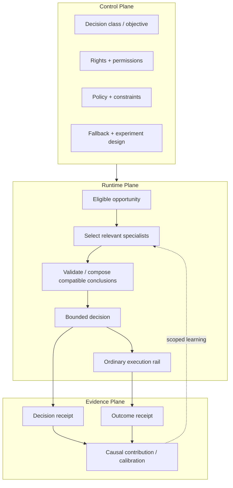
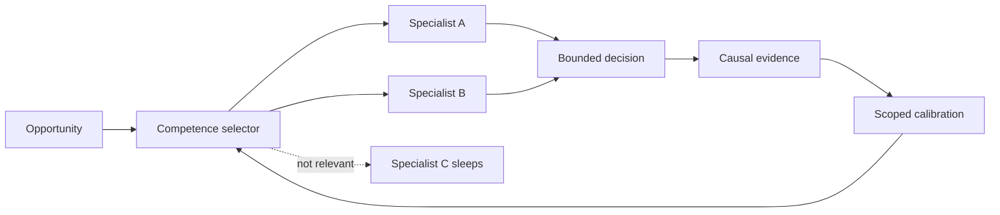

# OpenDecisioning

> ## Let specialized intelligence contribute without forcing everyone into one brain.

**Status:** `WORKING R&D`  
**Type:** bounded open-market decision architecture  
**Build posture:** prove one independently owned intelligence contribution before designing a general network

[← Research Portfolio](README.md) · [Lab Method](../LAB_METHOD.md) · [Ad Innovation Lab](../README.md)

## Executive thesis

Integrated platforms can connect signal, decision, execution, outcome, and learning inside one company. Open advertising systems can transact across companies, but useful intelligence remains distributed across publishers, advertisers, commerce systems, measurement providers, DSPs, SSPs, identity/data systems, and specialists.

The research question is not how to centralize all of that intelligence.

> **Can independently owned intelligence improve one governed economic decision without forcing the owner to surrender the underlying data, model, or decision rights?**

The larger thesis is that the open internet increasingly has **transaction interoperability** but may still lack **decision interoperability**.

---

## The system boundary

OpenDecisioning begins only after a rights holder has independently declared an eligible advertising opportunity. It does not create, time, move, or configure the underlying opportunity.

The first action surface should remain narrow: for example, bid/no-bid, a capped bid multiplier, demand eligibility, or a minimum economic threshold.

That constraint matters. The hypothesis is about composing intelligence into a bounded decision, not replacing the entire advertising stack.

---

## Separate authority from intelligence

The architecture becomes clearer when roles that are often collapsed inside vertically integrated systems are separated.

| Role | Responsibility |
|---|---|
| **Rights holder** | owns the permissible action space and non-negotiable constraints |
| **Intelligence provider** | contributes a bounded conclusion without necessarily exposing raw data or the underlying model |
| **Coordinator** | determines which eligible intelligence is relevant and compatible for this decision |
| **Executor** | performs the ordinary market action |
| **Evidence provider** | binds outcomes and causal evidence back to the decision |

The rights holder retains authority. Intelligence can inform a decision without inheriting the right to make every decision.

---

## Three-plane architecture

### Control plane

Defines the decision class, rights, participants, purpose, objective, policy, action vocabulary, fallback behavior, and experiment design.

### Runtime plane

Accepts bounded conclusions, validates scope and permissions, selects a small relevant set of specialists, composes only compatible evidence, enforces constraints, and executes through ordinary market rails.

### Evidence plane

Records what intelligence was used or rejected, what decision was made, what outcome followed, and whether the contribution created incremental causal value.

---

## The contribution object

A useful specialist contribution should expose only what the decision requires.

Candidate fields include:

- scope;
- provenance;
- model or deterministic origin where relevant;
- confidence and calibration;
- freshness and expiry;
- permitted use;
- policy constraints; and
- fallback behavior when unavailable.

The point is not to create a universal schema for every model. It is to make the contribution **decision-safe, attributable, and testable.**

## What made the thesis smaller

Running a partner model near an auction already exists as commercial substrate. Private model hosting, supply-side intelligence, and distributed execution are not sufficient differentiation by themselves.

That collision shifts the research higher in the stack:

- which specialist should be awake for this opportunity;
- how contradictory or correlated evidence is handled;
- how contribution is measured causally rather than by correlation;
- how specialist competence is calibrated over time;
- how new providers receive bounded exploration without gaming the system; and
- whether the resulting competence remains portable rather than becoming permanent property of one coordinator.

The surviving question is therefore less "can another model run here?" and more **"can independently owned intelligence prove what value it caused, and can that learning remain scoped and portable?"**

---

## First experiment

Do not start with a universal protocol or a provider marketplace.

Start with one bounded economic decision and two independently owned intelligence sources.

| Cell | Decision input |
|---|---|
| **A** | baseline decisioning |
| **B** | specialist 1 only |
| **C** | specialist 2 only |
| **D** | compatible composed intelligence |

Measure the advertiser objective plus relevant publisher economics, privacy/experience/reliability guardrails, latency, availability, and causal incrementality.

The purpose of the factorial design is to determine whether each source contributes incremental value and whether the combination adds value beyond the components.

### Important evaluation rule

Correlated providers must not be double-counted. Contradictory providers should not be resolved by majority vote. Provider quality must be scoped by context: objective, population, inventory domain, time horizon, policy, calibration, causal interval, latency, availability, drift, dependency, and manipulation risk.

---

## From model marketplace to competence routing

A future system should not invoke every provider on every opportunity.

A selector should route each opportunity to a small set of relevant "awake" specialists based on demonstrated scoped competence.

This should begin as an **allocation market**, not a cash market. Providers compete for bounded influence and randomized exploration rather than being rewarded simply for producing more claims.

---

## Portability test

OpenDecisioning should reduce the cost of remaining independent, not recreate vertical integration across more companies.

A strong later test is coordinator replaceability: can provider identity, scoped calibration, governance state, and enough causal evidence move to a second coordinator without turning the first coordinator into the permanent owner of network learning?

If not, the architecture may simply create a new intelligence gatekeeper.

## Kill tests

Reject or narrow the architecture if:

1. bilateral integrations scale adequately;
2. proprietary coordinators solve the problem without meaningful lost value or lock-in;
3. specialist intelligence cannot demonstrate incremental causal contribution;
4. latency, governance, privacy, or semantic coordination costs erase the benefit;
5. correlated or contradictory evidence cannot be handled safely;
6. portable competence creates more complexity than value; or
7. the mechanism works only when one company effectively controls the entire environment.

---

## What this is not

- an ad-break scheduler;
- an identity graph;
- a replacement DSP or SSP;
- a clean room;
- a general model marketplace;
- an agent framework; or
- a claim that openness is valuable without advertiser or publisher outcomes.

## Long-horizon branch

If bounded OpenDecisioning works, a later **Open Decision Network / Open Decision Exchange** can test competence routing, causal calibration, coordinator portability, and neutral market mechanisms for independently owned intelligence.

That future architecture is not required for the first product proof.

## Public boundary

This is R&D only. It is not a claim that a particular publisher, DSP, SSP, standards body, or technology provider has adopted the architecture, and it is not a claim of patent novelty. Public diagrams describe the research abstraction, not a prior employer's internal system.
